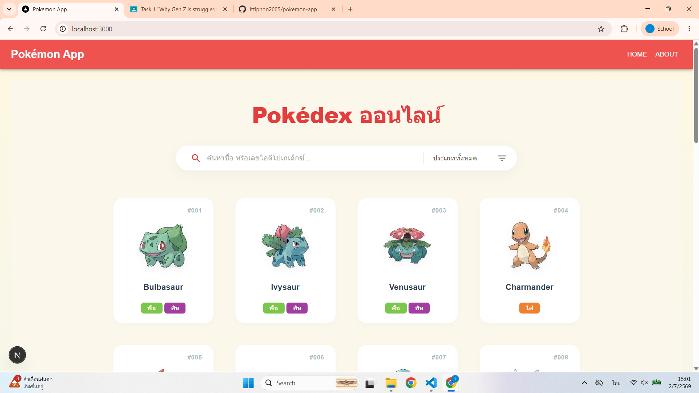
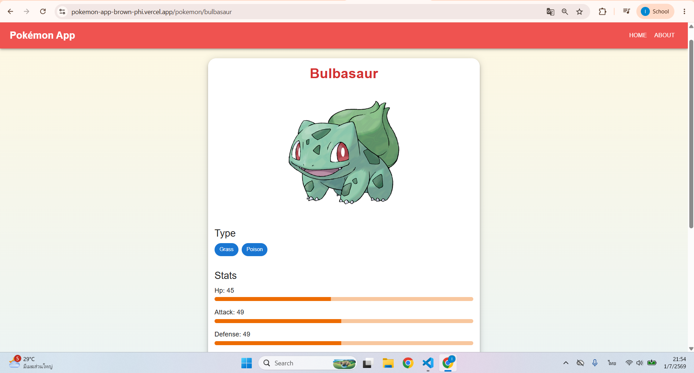
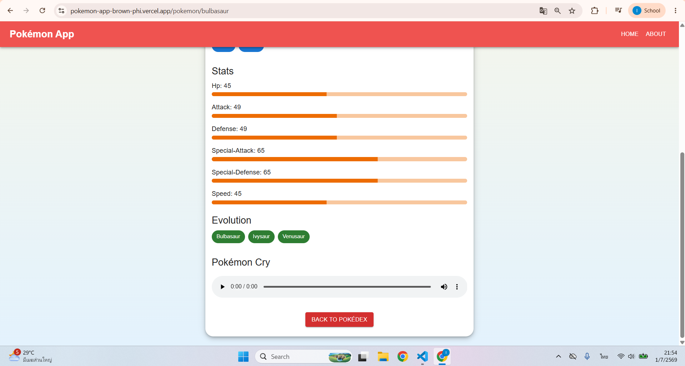
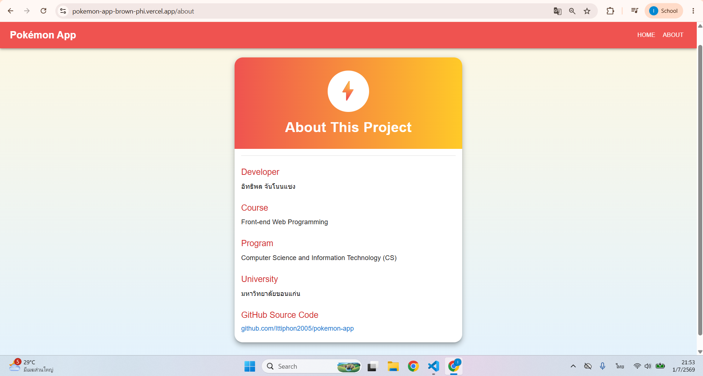

# 🎮 Pokémon App (Pokédex)

เว็บแอปพลิเคชันสารานุกรมโปเกมอน (Pokédex) ที่ดึงข้อมูลจากระบบมาแสดงผลในรูปแบบการ์ดที่สวยงาม ค้นหาง่าย และเข้าถึงข้อมูลเชิงลึกของโปเกมอนแต่ละตัวได้อย่างละเอียด

🔗 **Live Demo:** [pokemon-app-brown-phi.vercel.app](https://pokemon-app-brown-phi.vercel.app)

---

## 🧑‍💻 ข้อมูลผู้พัฒนา (Developer Information)

* **ผู้พัฒนา:** อิทธิพล จันโนนแซง (Ittiphon Jannonsaeng)
* **หลักสูตร:** Front-end Web Programming
* **สาขาวิชา:** วิทยาการคอมพิวเตอร์และเทคโนโลยีสารสนเทศ (Computer Science and Information Technology - CS)
* **สถาบัน:** มหาวิทยาลัยขอนแก่น (Khon Kaen University)
* **GitHub:** [@Ittiphon2005](https://github.com/Ittiphon2005)

---

## 📝 รายละเอียดโปรเจกต์ (Project Description)

โปรเจกต์นี้จัดทำขึ้นเพื่อเรียนรู้และฝึกฝนการพัฒนาเว็บแอปพลิเคชันยุคใหม่ โดยนำข้อมูลจาก PokeAPI มาประมวลผลและนำเสนอผ่านหน้าต่าง Interface ที่เป็นมิตรกับผู้ใช้งาน (User-Friendly UI) รองรับการเข้าดูข้อมูลสถิติพื้นฐาน, ประเภทธาตุ, สายการวิวัฒนาการ ไปจนถึงระบบเล่นเสียงร้องของโปเกมอน

### ✨ คุณสมบัติเด่น (Key Features)
* 🏛️ **Pokédex Grid Dashboard:** หน้าหลักแสดงรายการโปเกมอนพร้อมรูปภาพในรูปแบบการ์ดมินิมอล สะอาดตา
* 📊 **Base Stats & Mechanics:** แสดงค่าพลังพื้นฐานอย่างละเอียด (HP, Attack, Defense, Sp. Atk, Sp. Def, Speed) พร้อม Progress Bar สวยงาม
* 🧬 **Evolution Chain:** แสดงสายการวิวัฒนาการของโปเกมอนเพื่อให้ทราบลำดับขั้นในการเติบโต
* 🔊 **Pokémon Cry Integration:** มีเครื่องเล่นเสียง (Audio Player) สำหรับฟังเสียงร้องเฉพาะตัวของโปเกมอนแต่ละตัว
* 📄 **About Section:** หน้าเว็บสรุปข้อมูลของผู้พัฒนาและข้อมูลรายวิชาอย่างเป็นระบบ
* 🌍 **Cloud Deployment:** รองรับการทำงานแบบออนไลน์เต็มรูปแบบผ่าน Vercel

---

## 📸 ภาพหน้าจอการทำงาน (Screenshots)

### 1. หน้าหลัก (Pokédex Home Page)
แสดงรายการโปเกมอนทั้งหมดในรูปแบบ Grid Card ลิงก์ตรงสู่ข้อมูลเชิงลึก


### 2. หน้าแสดงรายละเอียดโปเกมอน (Pokémon Detail)
แสดงภาพขยาย, ประเภทธาตุ (Types), และกราฟแท่งแสดงค่าพลังสถิติพื้นฐาน (Stats)


### 3. ระบบวิวัฒนาการและเสียงร้อง (Evolution & Pokémon Cry)
ส่วนท้ายของหน้าข้อมูลจะแสดงสายวิวัฒนาการ (Evolution) และเครื่องมือเล่นเสียงร้องจริงของโปเกมอน


### 4. หน้าเกี่ยวกับผู้พัฒนา (About This Project)
หน้าเพจแสดงประวัติและรายละเอียดของผู้พัฒนาโปรเจกต์


---

## 🛠️ เทคโนโลยีที่ใช้ (Tech Stack)

* **Frontend Framework:** Next.js / React.js (รันบน Node.js Port 3000)
* **Styling:** CSS Components / Tailwind CSS (สไตล์การ์ดโค้งมนพร้อมเงาตกกระทบแบบนุ่มนวล)
* **Data API:** PokeAPI (RESTful API)
* **Deployment Platform:** Vercel

---

## 🚀 การติดตั้งเพื่อพัฒนาต่อ (Installation & Setup)

1. **Clone Repository:**
   ```bash
   git clone [https://github.com/Ittiphon2005/pokemon-app.git](https://github.com/Ittiphon2005/pokemon-app.git)
